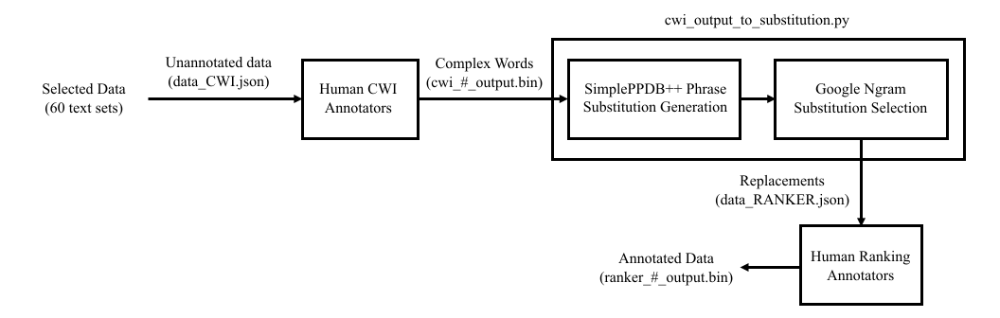

# Simplification Interface
Code to generate & and annotate data for evaluating end-to-end lexical simplification models.

## Data Collection Process

## Contents
This repo is split into two sections:
- `data-collection` - A set of python scripts used to generate data, generate substitutes from the initial CWI annotations and generate diagrams. It contains three scripts:
    - `generate_data.py` - See `data-collection/readme.md` for a description. **NOTE:** The inital data for the project has already been generated and is in `annotation-interface/data/data_CWI.json`
    - `cwi_output_to_substitution.py` - Given a folder containing the `.bin` output files from the CWI annotations, it generates a `data_RANKER.json` file which can be used.
    - `generate_diagrams.py` - Uses the generated data to create plots showing statistics about the data for the technical paper.
- `annotation-interface` - Used, along with GitHub Pages, to server the data to be annotated. There's no backend server, everything is done through static web pages.

## GitHub Pages
The annotation interface is a static website so it can be served through GitHub pages! Just change the paragraph number in the URL to assign different paragraphs to different annotators:

**CWI Interface:** 

    davidheineman.github.io/simplification-interface/annotation-interface/cwi?pg=0

**Ranker Interface:** 

    davidheineman.github.io/simplification-interface/annotation-interface/ranking?pg=0

**NOTE:** *When the CWI annotations are done, they MUST be run through `cwi_output_to_substitution.py` and the resulting `data_RANKER.json` file MUST be uploaded to `annotation-interface/data` so that the substitution selection annotation can work properly. This python script generates the substitutes that will then be annotated. Currently the repo has a demo `data_RANKER.json` file*

## Data Generation
`data-collection/generate_data.py` is used to generate a `data_CWI.json` with the inital data to be used by the human CWI annotators. This script contains the paragraph-set extraction algorithm which randomly selects a large paragraphs and adds its neighbors. The result is a csv containing 60 paragraphs to be used in the annotation inferface. 

### Data Used in the Project
- [Wikipedia](https://en.wikipedia.org/wiki/Wikipedia:Multiyear_ranking_of_most_viewed_pages) - `generate_data.py` downloads current articles
- [Wikinews](https://en.wikinews.org/wiki/Wikinews:Featured_articles) - `generate_data.py` downloads current articles
- [arXiv Abstracts](https://arxiv.org/search/advanced?advanced=1&terms-0-operator=AND&terms-0-term=&terms-0-field=title&classification-physics_archives=all&classification-include_cross_list=include&date-filter_by=all_dates&date-year=&date-from_date=&date-to_date=&date-date_type=submitted_date&abstracts=show&size=50&order=-announced_date_first) - The abstracts are copied and pasted into `arxiv.csv` (a demo `arxiv.csv` is provided)
- [Dataset of Reddit Posts from August 2013](https://www.kaggle.com/ammar111/reddit-top-1000) - The data is downloaded into a folder called `top-reddit`